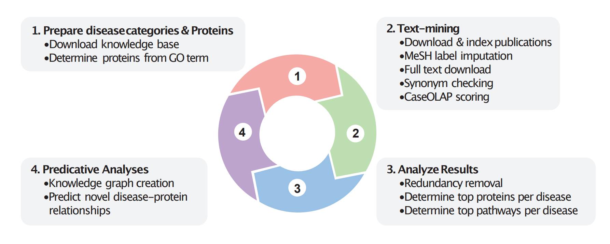
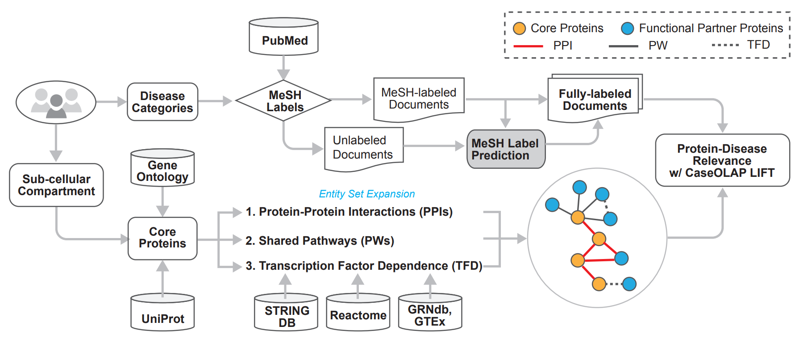

# CaseOLAP LIFT

This repository contains the code associated with the paper, “A knowledge graph approach to elucidate the role of organellar pathways in disease via biomedical reports". CaseOLAP LIFT is a new computational pipeline to investigate cellular component and disease associations by extracting user-selected information from text datasets (e.g., biomedical literature). The software identifies sub-cellular proteins and their functional partners, which are identified within disease-relevant documents. Additional disease-relevant documents are identified via the software’s label imputation method. To contextualize the resulting protein-disease associations and integrate information from multiple relevant biomedical resources, a knowledge graph is automatically constructed for further analyses. (Publication pending)




The input data and program output associated with the paper are accesible at the following link: https://archive.org/details/caseolap_lift_data_archive

### Set-up and installation
CaseOLAP LIFT is executed through a command-line interface. Installation instructions will be released soon. This software is also released as a Docker Container at (https://hub.docker.com/repository/docker/caseolap/caseolap_lift/general). 

#### Starting up the Docker Container
Pull the docker container using the following command:
```
docker pull caseolap/caseolap_lift:latest 
```

Start the docker container with the following command:
```
docker run --name caseolap_lift -it -v PATH_TO_FOLDER:/caseolap_lift_shared_folder caseolap/caseolap_lift:latest bash
```

Start the Elastic Search
```
docker exec -it --user elastic caseolap_lift bash /workspace/start_elastic_search.sh
```

### CaseOLAP LIFT Command Line Interface
CaseOLAP LIFT can be run interactively performing every step sequentially or executed end-to-end by passing in as a parameters.txt file. The parameters.txt used in this study are in ‘caseolap_lift/parameters.txt’. Instructions on generating a parameters file will be released soon.

### Preparing diseases and proteins
The preprocessing step of this pipeline assembles specific diseases, list proteins to study, and gathers protein synonyms for text-mining. Execute the below command for additional details:
```
‘python caseolap_lift.py preprocessing --help’. 
```

Biomedical data are downloaded from knowledge bases online. The corresponding file names are shown below.
```
GO Ontologies: go-basic.obo

GO to Proteins: goa_human.gaf

UniProt Human Proteome: UP000005640_9606.fasta

Proteins to Pathways (leaf node pathways in Reactome’s pathway hierarchy): UniProt2Reactome.txt

Proteins to Pathways (all pathways): UniProt2Reactome_All_Levels.txt

Pathways: ReactomePathwaysRelation.txt

Pathway names: ReactomePathways.txt

MeSH Term Data: desc2022.xml 

MeSH Tree Data: mtrees2022.bin

GRNdb/GTEx Transcription Factors: Files from GRNdb
```


The following flags are required:
```
-d disease list: a list of MeSH tree numbers for your diseases of interest. Separate disease categories by spaces. Separate tree numbers of the same category by commas.
-c cellular component: a list of space-separated GO terms representing cellular component(s), molecular function(s), and/or biological process(es).
```
The following flags are optional:
```
-a disease abbreviations: User-named abbreviations for disease categories of interest. Must match the number of disease categories passed in.
-l protein list: list of additional proteins to include in this analysis. Only UniProtKB IDs are accepted; unmapped IDs will be discarded. A list of proteins may be provided in place of GO term.
--include-ppi: Flag indicates proteins with known protein-protein interaction via STRING will be added to functionally related proteins.
-k ppi_k: indicates how many hops of protein-protein interactions to include. (e.g. k = 2 will include neighbors of neighbors) Default: 1.
-s ppi_score_thresh: only protein-protein interactions with a score greater than this threshold will be included.
--include-pw: Flag indicates proteins which share significant biological pathways via Reactome to be added to functionally related proteins.
-n pathway_count_thresh: minimum number of cellular component proteins required to consider a pathway as significant. Default: 4.
-r pathway_prop_thresh: minimum proportion of cellular component proteins required to consider a pathway as significant. Default: 0.5.
--include-tfd: Flag indicates that proteins related via transcription factor from GRNdb will be added to the functionally related proteins.
-o output_folder: directory where all data and results will be stored. Please make sure to use the same output folder for all steps, as future steps rely on files output from previous steps.
-p parameter_file: will bypass all options and run based on parameters.txt or parameters.json file.
```
	
Example command:
```	
python caseolap_lift preprocessing -a
"CM ARR CHD VD IHD CCD VOO OTH" -d "C14.280.238,C14.280.434 C14.280.067,C23.550.073 C14.280.400 C14.280.484 C14.280.647 C14.280.123 C14.280.955 C14.280.195,C14.280.282,C14.280.383,C14.280.470,C14.280.945,C14.280.459,C14.280.720" -c "GO:0005739" --include-synonyms --include-ppi -k 1 -s 0.99 --include-pw -n 4 -r 0.5 --include-tfd
```
### Text mining
Run the text-mining module of CaseOLAP LIFT using command-line options. Document download, parsing, and indexing are handled end-to-end. Detailed troubleshooting steps for a previous yet similar version of this step are described in CaseOLAP’s protocol (https://www.jove.com/v/59108/cloud-based-phrase-mining-analysis-user-defined-phrase-category)

A list of command-line flags can be found by typing the command ‘python caseolap_lift.py text_mining --help’. The following flags are optional:
```
-d date_start date_end: Specify the date range for PubMed documents which will be downloaded. Provide both dates in YYYY-MM-DD format, separated by comma. By default, all available publications will be downloaded.
-l include label-imputation: A flag indicating the software to use label-imputation during text-mining. Default: False. NOTE: Most labels are correct (87% precision), but most relevant unlabeled documents are left unlabeled (2% recall).
-t include full-text: A flag indicating the software to include full-text documents during text-mining. Default: False.
-c check_synonyms: A flag indicating the software to halt function to screen ambiguous protein names. Details described in the following section. 
-r rerun_scoring: A flag indicating the software to re-run CaseOLAP score calculation after updating synonym list.
-o output_folder: directory where all data and results will be stored. Please make sure to use the same output folder for all steps, as future steps rely on files output from previous steps.
-p parameter_file: will bypass all options and run based on parameters.txt or parameters.json file.
```
	
Example command:
```	
python caseolap_lift text_mining -d "2012-10-01,2022-10-01" -l -t
```

### Analyze results
Run the analysis module of CaseOLAP LIFT using command-line options. This step identify diseases’ top proteins and pathways and generates figures supporting the manuscript.

Type ‘python caseolap_lift.py analysis --help’ to find command line flags. The following flags are optional:
```
-z z_score_thresh: the threshold for considering if a protein’s disease-specific score is significant. Default: 3.0.
--analyze_core_proteins: analyze only core proteins (i.e., GO term-related proteins). Default: False.
--analyze_all_proteins: analyze core proteins and their functionally related proteins. Default: True.
-o output_folder: directory storing all data and results. Use the same output folder for all steps, as future steps rely on previous steps’ output files.
-p parameter_file: bypass all options and run based on parameters.txt or parameters.json file.
```
	
Example command:
```	
python caseolap_lift analyze_results -z 3.0 --analyze_core_proteins
```


### Predictive Analysis
#### Construct the Knowledge Graph
A knowledge graph is constructed from the results from text-mining and contextualized among other functionally related biomedical entities. 

Type ‘python caseolap_lift.py prepare_knowledge_graph --help’ to find command line flags. The following flags are optional:
```
--include_tfd: include edges between proteins based on transcription factor dependence. Default: True.
--include_ppi: include edges between proteins based on interactions. Default: True.
--include_pw: include edges between proteins and Reactome pathways (pathway nodes are otherwise excluded). Default: True.
--include_mesh: include MeSH disease hierarchy edges. Default: True.
--use_z_score: Use z-score transformed scores as edge weights. By default, original CaseOLAP scores will be used.
--scale_z_score: Make z-scores non-negative edge weights. 
--include_all_proteins: include functionally related proteins. Default: True.
--include_core_proteins: only include core proteins. Default: False.
-o output_folder: directory storing all data and results. Use the same output folder for all steps, as future steps rely on previous steps’ output files.
-p parameter_file: bypass all options and run based on parameters.txt or parameters.json file.
```
	
Example command:
```	
python caseolap_lift prepare_knowledge_graph --scale_z_score
```

### Predict novel protein-disease associations
This constructed knowledge graph is leveraged to predict protein-disease associations. Implemented with GraPE (https://github.com/AnacletoLAB/grape), this uses DistMult to produce knowledge graph embeddings which a multi-layer perceptron uses to predict protein-disease associations. This code serves as an example and a starting point for other analyses.

Example command:
```
python kg_analysis/run_kg_analysis.py
```
Only predictions with a predicted probability >0.9 are included (predictions.csv). Model evaluations are also saved (eval_results.csv).
